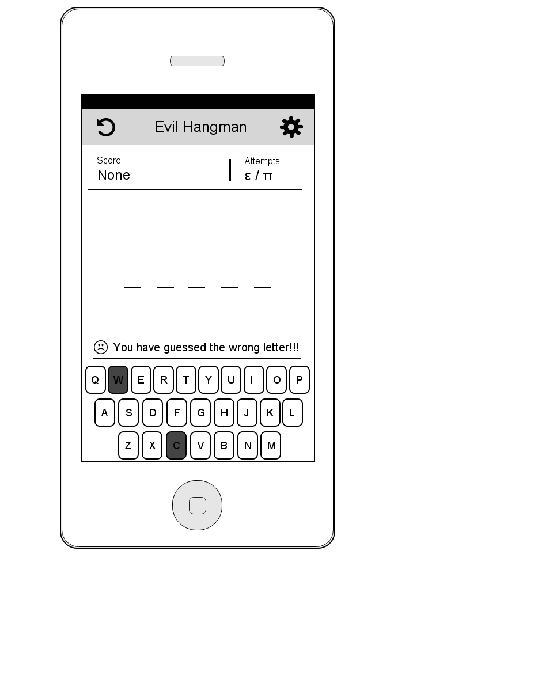
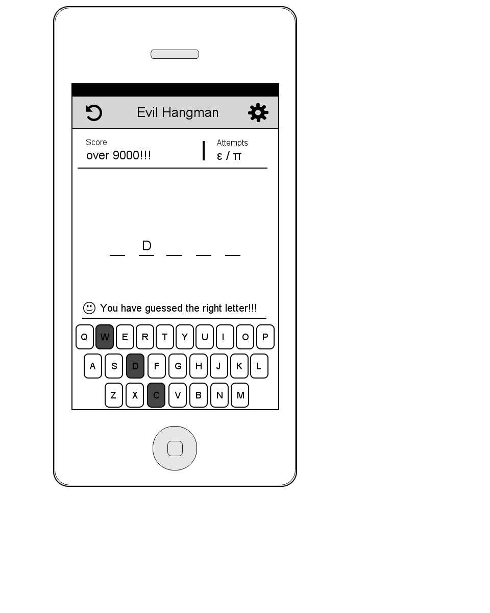
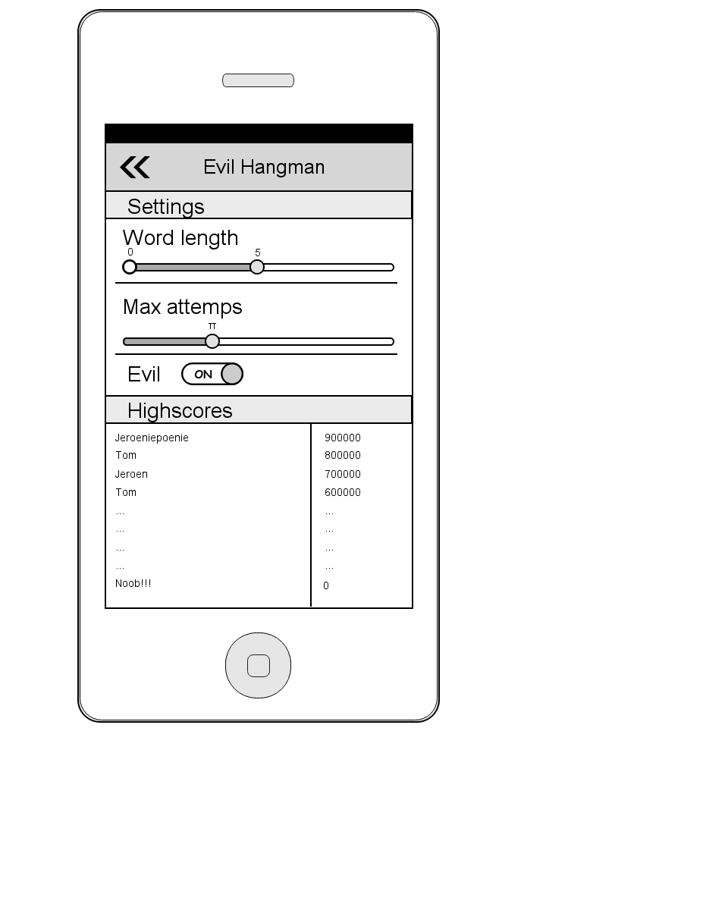

## Design Document

### Database Mapping
None

### Classes and Methods

*	Class MainActivity
	*	WordList words
	*	String current_word
	*	int current_attempts
	*	int max_attempts
	*	int min_word_length
	*	int max_word_length
	*	ArrayList<Character> guessed_characters
	*	String match_holder
	*	void NewGame()
	*	void UpdateWord()
	*	void UpdateAttempts()
	*	void processKey(int keyCode)
	*	void CorrectAnswer()
	*	void WrongAnswer()
 
*	Class WordList
	*	WordListItem current_word_list_model
	*	void parseWords(Context ctx)
	*	String getRandomWord()
 
*	Class WordListItem
	*	String GetEvilWord(String old_word, String matches, ArrayList<Character> guessed_characters)
 
*	Class DatabaseHandler
	* void onCreate()
	* void onUpgrade()
	* void addHighscore(String name, Integer score)
	* List<Object> getHighscore()
	* List<Object> getSettings()
	* void saveSettings(List<Object> Settings)
 

### Features Summary
*	Users find themselve in the game immediately upon launch.
*	Users can see the current word as placeholder on the screen
*	Users can see their incorrect guesses and attempts
*	Users have access to a on-screen keyboard and hardware keyboard if present.
*	Words are not case sensitive
*	Invalid input will be ignored while notifying the user
*	Users can start a new game at any time
*	Difficulty of the game can be changed in the settings view
*	A list of highscores / played games can be accesses aswell.

### UI Sketches

### Moqup
[https://moqups.com/TomPC/ArzdK2Pq](https://moqups.com/TomPC/ArzdK2Pq)